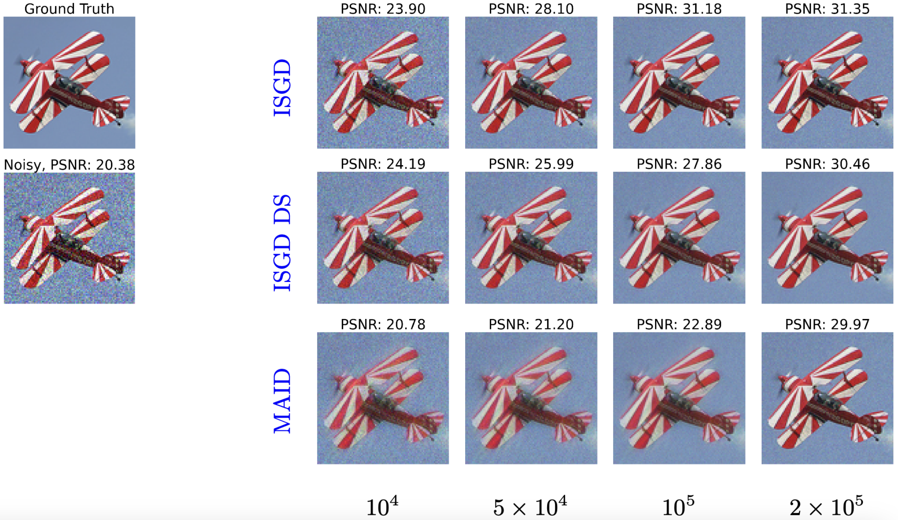
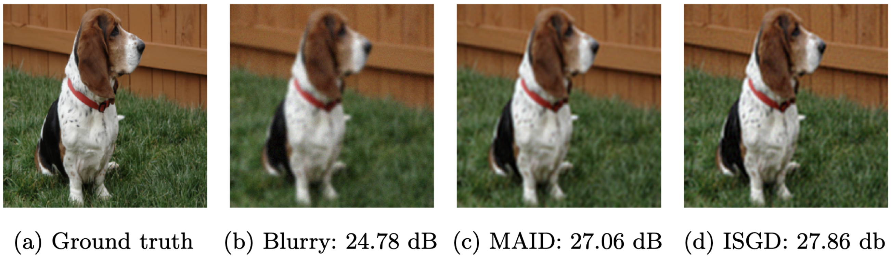
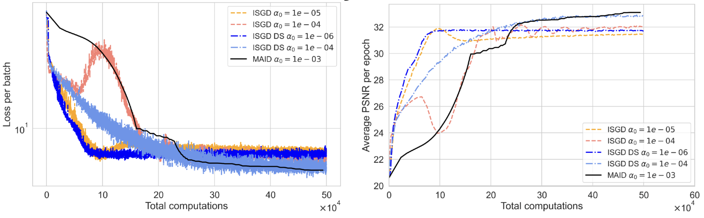

# **Bilevel Learning with Inexact Stochastic Gradients**  

This repository contains the implementation of the inexact stochastic bilevel optimization method presented in the paper:  

**[Bilevel Learning with Inexact Stochastic Gradients](https://arxiv.org/abs/2412.12049)**  
Mohammad Sadegh Salehi, Subhadip Mukherjee, Lindon Roberts, Matthias J. Ehrhardt  

Bilevel learning plays a crucial role in machine learning, inverse problems, and imaging applications, such as hyperparameter optimization, learning data-adaptive regularizers, and optimizing forward operators. Our work introduces an inexact stochastic bilevel optimization framework with strongly convex lower-level problems and a nonconvex sum-of-functions in the upper level. We establish connections to stochastic optimization theory, ensuring convergence under mild assumptions. The proposed method improves efficiency and generalization in imaging tasks like image denoising and deblurring compared to existing adaptive deterministic bilevel methods.  

---

## **Paper Reference**  

[](https://arxiv.org/abs/2412.12049)  
**[Bilevel Learning with Inexact Stochastic Gradients](https://arxiv.org/pdf/2412.12049.pdf)**  

- [Mohammad Sadegh Salehi](https://scholar.google.com/citations?user=bunZmJsAAAAJ&hl=en)  
- [Subhadip Mukherjee](https://scholar.google.com/citations?user=a4UlE_MAAAAJ&hl=en)  
- [Lindon Roberts](https://scholar.google.com/citations?user=s8Xj5BgAAAAJ&hl=en)  
- [Matthias J. Ehrhardt](https://scholar.google.com/citations?user=dkbrSccAAAAJ&hl=en)  

---

## **Description**  

This repository implements the proposed inexact stochastic bilevel optimization framework, focusing on practical applications such as:  

- Learning data-adaptive regularizers  
- Hyperparameter optimization  
- Optimizing forward operators for imaging applications (MRI)  

### **Key highlights of our approach:**  
✅ Inexact stochastic hypergradients for improved efficiency  

✅ Theoretical connection to the state-of-the-art analysis of biased SGD

✅ Theoretical convergence guarantees  

✅ Faster training and better generalization than deterministic bilevel methods  

---

## **Installation**  

### **1. Clone the repository**  
```bash
git clone git@github.com:MohammadSadeghSalehi/SMAID.git
cd SMAID
```

 - Install the necessary dependencies:

    ```bash
    pip install numpy matplotlib scikit-learn torch torchvision tqdm deepinv
    ```
    * Note: Ensure you have Python 3.6 or higher installed.
## Usage

 **Running the main script:**

    ```bash
    python train.py
    ```
    
    * By default, the script uses the implicit function theorem-based bilevel optimization setting. 
2.  **Modifying parameters:**

    * The `train.py` script contains parameters that can be adjusted to control the optimization process. These include:
        * `problem`: Denoising or Deblurring.
        * `img_size_x` and `img_size_y`: The size of the input image.
        * `channels`: Determines if the image is coloured or grayscale.
        * `train_size`: The number of training images.
        * `batch_size`: Size of mini-batches.
        * `alpha`: Step size.
        * `eps0`: Accuracy of the lower-level solver.
        * `p`: Exponent of the decreasing factor of the accuracy (1/k^p).
        * `q`: Exponent of the decreasing factor of the step size (1/k^q).

    * Adjust these parameters within the `train.py` file to experiment with different settings.

  **Input Images:**
    * The Oxford-Pet dataset and STL-10 are used and will be downloaded automatically by the data loader.
  **Output images:**
    * The checkpoint training and test images will be saved automatically.

## Results

## Denoising training checkpoints


## Deblurring Test image


## Perfomance comparison 

Comparison of Inexact Stochastic Gradient Descent (ISGD) with fixed and decreasing step sizes to the Method of Adaptive Inexact Descent (MAID).

#
**How to cite**

    @misc{salehi2024bilevellearninginexactstochastic,
      title={Bilevel Learning with Inexact Stochastic Gradients}, 
      author={Mohammad Sadegh Salehi and Subhadip Mukherjee and Lindon Roberts and Matthias J. Ehrhardt},
      year={2024},
      eprint={2412.12049},
      archivePrefix={arXiv},
      primaryClass={math.OC},
      url={https://arxiv.org/abs/2412.12049}, 
}
